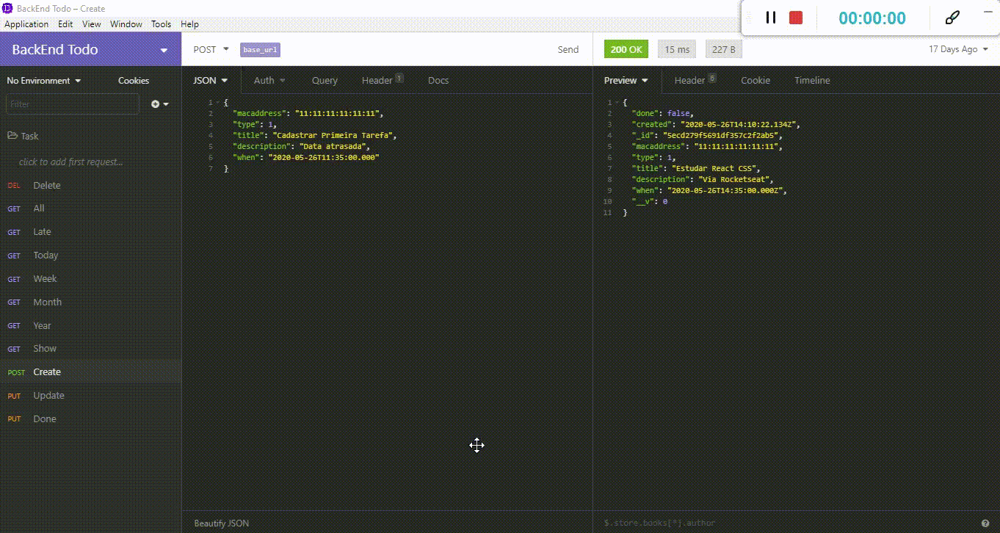

<h1 align=center>


---
Task One 1.0 - Gerenciador de tarefas <br/><br/> 🚀 Done!
</h1>

## 📑️ - Índice:

- [Task One](#-ℹ️-O-que-é-a-Task-One)
- [O projeto](#📝️-Sobre)
- [Tecnologias utilizadas](#🚀️-Tecnologias-utilizadas)
- [Como usar](#💾️-Como-baixar/testar-o-projeto)
- [Contato](#-Desenvolvido-com-💙️-por)
- [Licença](#-Licença)

---

## 📝️ Sobre

O projeto **Task One** é um controlador de tarefas, que visa melhorar o seu dia a dia, com controle total de tarefas cadastradas.

---

## Apresentação de funcionamento das rotas

<h1>

</h1>

## Dados da tarefa: 

<ol>
  <li> Tipo - ✔️  </li>
  <li> Título - ✔️  </li>
  <li> Descrição - ✔️  </li>
  <li> Data e Hora - ✔️  </li>
  <li> Status - ✔️ </li>
</ol>

## Ações: 

<ol>
  <li> Criar - ✔️ </li>
  <li> Atualizar - ✔️ </li>
  <li> Visualizar todas - ✔️ </li>
  <li> Visualizar por ID - ✔️ </li>
  <li> Deletar por ID - ✔️ </li> 
  <li> Atualizar Status - ✔️ </li>
  <li> Visualizar Atrasadas - ✔️ </li>
  <li> Visualizar tarefas dia - ✔️ </li>
  <li> Visualizar da semana - ✔️ </li>
  <li> Visualizar do mês - ✔️ </li>
  <li> Visualizar do ano - ✔️ </li>
</ol>


---
## 🚀️ Tecnologias utilizadas

O projeto foi desenvolvido utilizando as seguintes tecnologias:

- JavaScript
- NodeJS
- npm
- ExpressJS
- cors
- date-fns
- Nodemon
- mongodb
- mongoose

---

## 💾️ Como baixar/testar o projeto

- Você irá precisar instalar o [Git](https://git-scm.com/), [NodeJS](https://nodejs.org/pt-br/download/) + [npm](https://www.npmjs.com/get-npm) + [MongoDb](https://docs.mongodb.com/manual/installation/) + [Insomnia](https://insomnia.rest/download/core/?):

```bash
# Versões mínimas ou superiores.
$ node -v
v12.16.3

$ npm -v
6.14.5

$ 
```

- Para configurar, no bash digite os seguinte códigos:

```bash
# Clonar o repositório
$ git clone https://github.com/RicardoMejolaro/Back-End-Task-One-With-NodeJs.git

#Entrar no diretório
$ cd backend-task-one

#Instalar as dependências
$ npm install

#Iniciar o local host
$ npm start
```

- Por ultimo abra seu navegador e digite:

```
localhost:3001 para rota get
```

- Para testar as rotas, abrir o Insomnia, importar o arquivo:
 Rotas_da_API_Insomnia.json e testar obedecendo as suas regras.

---

### Desenvolvido com 💙️ por

***Ricardo Mejolaro*** 
<br/> 
<a href="https://www.linkedin.com/in/ricardo-mejolaro/">

</a>

### Licença

Este projeto está licenciado sob a licença MIT - consulte a página [LICENSE](https://opensource.org/licenses/MIT) para obter detalhes.